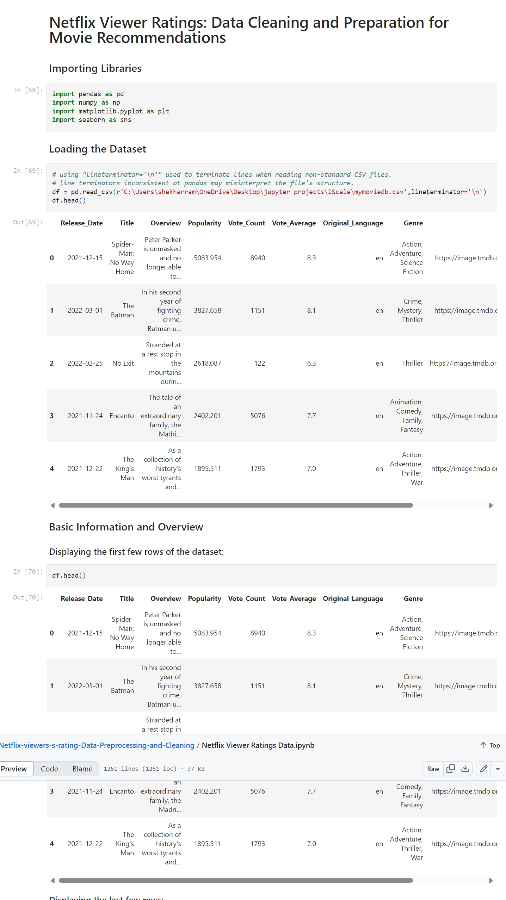

# Netflix Viewer Ratings: Data Cleaning and Preparation for Movie Recommendations

## Overview
This project focuses on cleaning and preparing a Netflix viewers' rating dataset to enhance its accuracy, consistency, and usability for movie recommendation systems.

## Dataset Exploration Summary
- The dataset consists of 9,827 rows and 9 columns.
- Initially, the dataset has no missing values or duplicates, making it relatively clean.
- The `Release_Date` column needs to be converted to the correct datetime format.
- Columns like `Overview`, `Original_Language`, and `Poster-Url` are deemed unnecessary for the analysis and were removed.
- The `Popularity` column contains noticeable outliers, which were handled to ensure accurate analysis.
- The `Vote_Average` column was categorized for better analysis.
- The `Genre` column contains comma-separated values with extra spaces, which were cleaned and standardized.

## Tasks Performed
1. Cleaned and formatted the `Release_Date` column to the proper datetime format.  
2. Removed irrelevant columns such as `Overview`, `Original_Language`, and `Poster-Url`.  
3. Handled outliers in the `Popularity` column for improved analysis accuracy.  
4. Categorized the `Vote_Average` column to facilitate proper analysis.  
5. Cleaned and standardized the `Genre` column by handling comma-separated values and removing extra spaces.  
6. Ensured the dataset was ready for movie recommendation model development by optimizing data structure and consistency.

## Screenshot
Below is a screenshot of the Jupyter Notebook used in this project:

